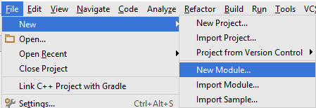
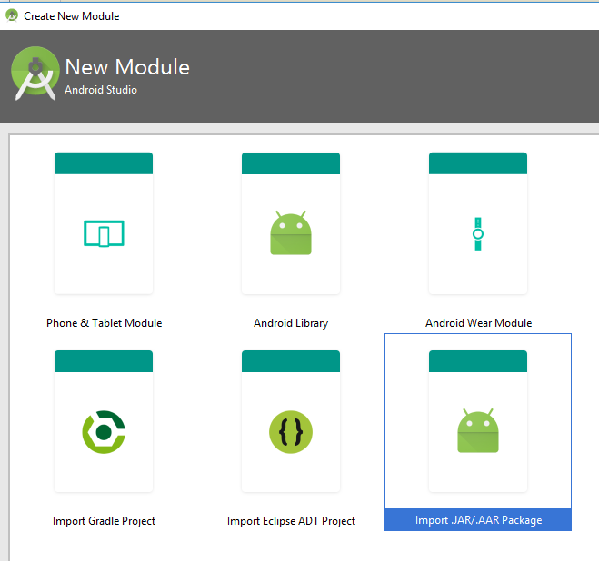
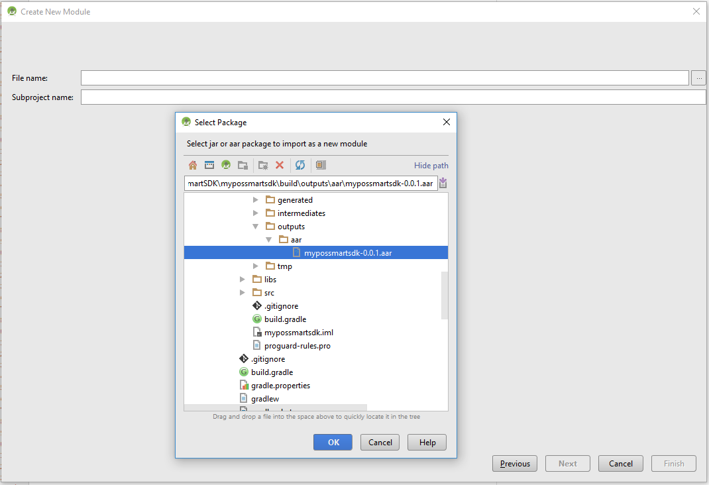
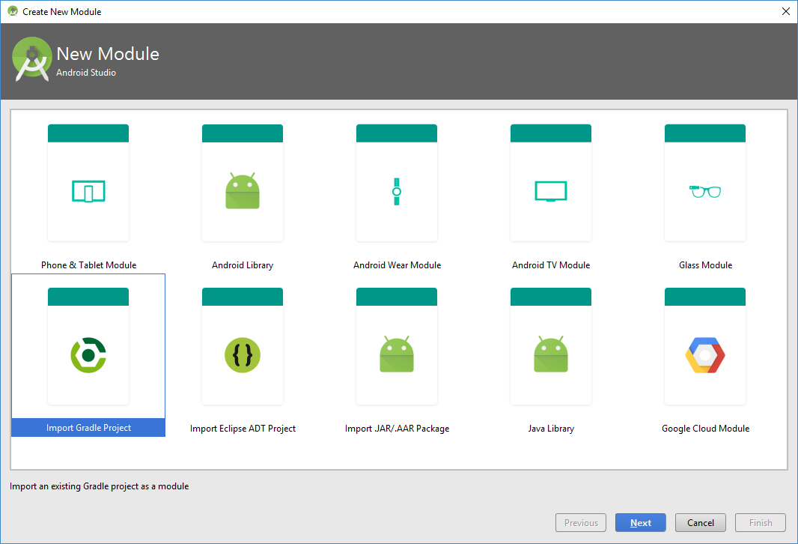
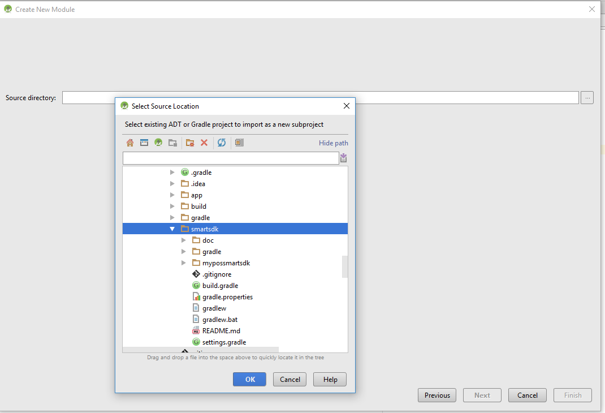
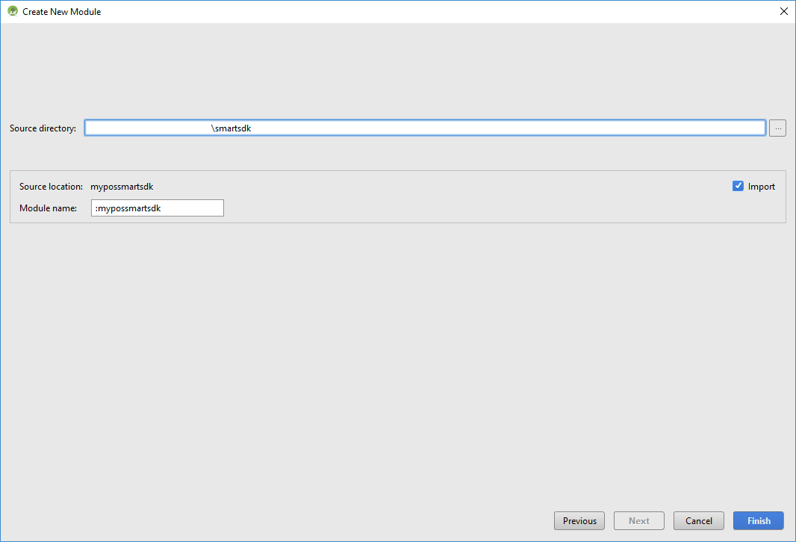

# myPOS-Smart-SDK

This repository provides a guidance how to build your own app on Android myPOS Smart POS device and communicate with the core module of the device, to accept card payments (including but not limited to VISA, Mastercard, UnionPay International, JCB, Bancontact). To process checkout SDK provides management of the terminal to complete all the steps for transaction processing, refund funds to the customer card account, using printer of the device to print your own bill slip.

No sensitive card data is ever passed through to or stored on the merchant&#39;s phone. All data is encrypted by the core card terminal module, which has been fully certified to the highest industry standards (PCI, EMV I &amp; II, Visa, MasterCard &amp; Amex).

### Table of Contents

* [Installation](#installation)

  * [Build the library and add it as a dependency](#build-the-library-and-add-it-as-a-dependency)

  * [Add the library to your project](#add-the-library-to-your-project)

  * [As a git submodule](#as-a-git-submodule)

* [Usage](#Usage)

  * [Process checkout](*process-checkout)

  * [Refund request](*refund-request)

  * [Print the last transaction receipt](*print-the-last-transaction-receipt)

  * [Print a custom receipt](*print-a-custom-receipt)

* [Response](#response)

## Installation

Using the SDK can be done by adding it as a git submodule to your project or building the .aar and using it.

### Build the library and add it as a dependency


1. Download the source code and import it in Android Studio
2. Build it
3. Navigate to the `build/outputs/aar` folder and retrieve the .aar file

### Add the library to your project

After building the library, add it as a dependency in Android Studio, create a new module.



In the window that appears, select "Import JAR/.AAR Package" and click "Next"



Then navigate to where the generated .aar file is located and select it, then click "Finish"




In your `build.gradle` file add the newly-created module as a dependency:
```groovy
dependencies {
    // [...]
    compile project(':mypossmartsdk-0.0.1')
}
```


### As a git submodule

If your project uses git for version control, run the following command in the project's root:
``` bash
git submodule add https://github.com/developermypos/myPOS-Smart-SDK.git smartsdk
```
__Note:__ Older versions of Git might need ``git submodule update --init --recursive`` to be called

After git finishes cloning the module, create a new module in your project:


In the window that appears, select Import Gradle Project and click "Next":



Navigate to your project's root directory. Select the ``smartsdk`` directory:



After clicking "OK", click "Finish" and the module should be ready to use:



Add the module to your ``build.gradle``'s dependencies section:
```groovy
dependencies {
    // [...]
    compile project(path: ':mypossmartsdk')
}
```

# Usage

Once the SDK is added to your project, using the Payment API can be done with the provided helper classes.


### Process a checkout


##### 1. Make the payment

```java
// Build the payment call
 MyPOSPayment payment = MyPOSPayment.builder()
         // Mandatory parameter
         .productAmount(13.37)
         // Foreign transaction ID. Maximum length: 128 characters
         .foreignTransactionId(UUID.randomUUID().toString())
         .build();

 // Start the transaction
 MyPOSAPI.openPaymentActivity(MainActivity.this, payment, 1);
```


##### 2. Handle the result

In your calling Activity, override the ``onActivityResult`` method to handle the result of the payment:

```java
@Override
protected void onActivityResult(int requestCode, int resultCode, Intent data) {
    // The same request code as when calling MyPOSAPI.openPaymentActivity
    if (requestCode == 1) {
        // The transaction was processed, handle the response
        if (resultCode == RESULT_OK) {
            // Something went wrong in the Payment core app and the result couldn't be returned properly
            if (data == null) {
                Toast.makeText(this, "Transaction cancelled", Toast.LENGTH_SHORT).show();
                return;
            }
            int transactionResult = data.getIntExtra("status", TransactionProcessingResult.TRANSACTION_FAILED);

            Toast.makeText(this, "Payment transaction has completed. Result: " + transactionResult, Toast.LENGTH_SHORT).show();

            // TODO: handle each transaction response accordingly
            if (transactionResult == TransactionProcessingResult.TRANSACTION_SUCCESS) {
                // Transaction is successful
            }
        } else {
            // The user cancelled the transaction
            Toast.makeText(this, "Transaction cancelled", Toast.LENGTH_SHORT).show();
        }
    }
}

```

Checking if the transaction is approved can be done by reading the ``transaction_approved`` boolean extra from the response:

```java
boolean transaction_approved = data.getBooleanExtra("transaction_approved", false);

if (transaction_approved) {
    // Transaction is approved
} else {
    // Transaction was not approved
    // The response code is in the "response_code" string extra
}

```


### Refund request


##### 1. Perform the refund

``` java
// Build the refund request
MyPOSRefund refund = MyPOSRefund.builder()
        .refundAmount(1.23)
        .foreignTransactionId(UUID.randomUUID().toString())
        .build();

// Start the transaction
MyPOSAPI.openRefundActivity(MainActivity.this, refund, 2);
```

##### 2. Handle the result

The same as with the payment, in your calling Activity, override the ``onActivityResult`` method to handle the result of the refund:

```java
@Override
protected void onActivityResult(int requestCode, int resultCode, Intent data) {
    // The same request code as when calling MyPOSAPI.openRefundActivity
    if (requestCode == 2) {
        // The transaction was processed, handle the response
        if (resultCode == RESULT_OK) {
            // Something went wrong in the Payment core app and the result couldn't be returned properly
            if (data == null) {
                Toast.makeText(this, "Transaction cancelled", Toast.LENGTH_SHORT).show();
                return;
            }
            int transactionResult = data.getIntExtra("status", TransactionProcessingResult.TRANSACTION_FAILED);

            Toast.makeText(this, "Refund transaction has completed. Result: " + transactionResult, Toast.LENGTH_SHORT).show();

            // TODO: handle each transaction response accordingly
            if (transactionResult == TransactionProcessingResult.TRANSACTION_SUCCESS) {
                // Transaction is successful
            }
        } else {
            // The user cancelled the transaction
            Toast.makeText(this, "Transaction cancelled", Toast.LENGTH_SHORT).show();
        }
    }
}

```


### Print the last transaction receipt

Printing the last transaction receipt is done by sending a broadcast.

##### 1. Send the broadcast
```java
Intent intent = new Intent(MyPOSUtil.PRINT_LAST_RECEIPT_BROADCAST);
// Whether or not a copy for the customer should be printed
intent.putExtra("print_customer_receipt", true);
sendBroadcast(intent);
```

##### 2. Handle the printing result

When the printing is finished, the Payment core will return a broadcast with intent `com.mypos.broadcast.PRINTING_DONE`.

```java
public class PrinterResultBroadcastReceiver extends BroadcastReceiver {

    @Override
    public void onReceive(Context context, Intent intent) {
        boolean printing_started = intent.getBooleanExtra("printing_started", false);
        int printer_status = intent.getIntExtra("printer_status", PrinterStatus.PRINTER_STATUS_UNKNOWN_ERROR);

        // If the printing has actually started, handle the status
        if (printing_started) {

            // Handle success and errors
            if (printer_status == PrinterStatus.PRINTER_STATUS_SUCCESS) {
                Toast.makeText(context, "Printing successful!", Toast.LENGTH_SHORT).show();
                // Printing is successful
            } else if (printer_status == PrinterStatus.PRINTER_STATUS_OUT_OF_PAPER) {
                // Show "missing paper" dialog
                Toast.makeText(context, "No paper in the printer", Toast.LENGTH_SHORT).show();
            } else {
                Toast.makeText(context, String.format("Some error occurred while printing. Status: %d", printer_status), Toast.LENGTH_SHORT).show();
            }
            // etc.
        } else {
            // Some other error occurred. Maybe there's no transaction data (when printing last transaction receipt).
            Toast.makeText(context, String.format("Error occurred while printing. Status: %d", printer_status), Toast.LENGTH_SHORT).show();
        }
    }
}

```


### Print a custom receipt

Just like reprinting the last receipt, printing a custom receipt is done by sending a broadcast.

##### 1. Send the print broadcast

The printing broadcast accepts a list of PrinterCommand objects serialized as JSON. Gson can be used to serialize the objects.

A PrinterCommand can be one of the following types:

* HEADER – prints merchant data and time and date. The time and date must be sent with the broadcast
* LOGO – prints the device’s logo.
* TEXT – prints arbitrary text. Double width and height are available as parameters
* FOOTER – prints a footer with a “Thank you” message

If you decide to use Gson, add it to your project’s `build.gradle` file:
`compile 'com.google.code.gson:gson:2.8.0'`

An example print broadcast can look like this:

```java
String json; // The serialized list of commands

List<PrinterCommand> commands = new ArrayList<>();

// Add commands to be sent
commands.add(new PrinterCommand(PrinterCommand.CommandType.TEXT, "Normal row 1\n"));
// [...]
commands.add(new PrinterCommand(PrinterCommand.CommandType.TEXT, "Double height\n\n\n", false, true));
// [...]
commands.add(new PrinterCommand(PrinterCommand.CommandType.FOOTER));

// Serialize the command list
Gson gson = new Gson();
json = gson.toJson(commands);

System.out.println("Sending print broadcast: " + json);

Intent intent = new Intent(Util.PRINT_BROADCAST);

// Add the commands
intent.putExtra("commands", json);

// Send broadcast
sendBroadcast(intent);


```

##### 2. Handle the printing result

When the printing is finished, the Payment core will return a broadcast with intent `com.mypos.broadcast.PRINTING_DONE`.

```java
public class PrinterResultBroadcastReceiver extends BroadcastReceiver {

 @Override
 public void onReceive(Context context, Intent intent) {
     boolean printing_started = intent.getBooleanExtra("printing_started", false);
     int printer_status = intent.getIntExtra("printer_status", PrinterStatus.PRINTER_STATUS_UNKNOWN_ERROR);

     // If the printing has actually started, handle the status
     if (printing_started) {

         // Handle success and errors
         if (printer_status == PrinterStatus.PRINTER_STATUS_SUCCESS) {
             Toast.makeText(context, "Printing successful!", Toast.LENGTH_SHORT).show();
             // Printing is successful
         } else if (printer_status == PrinterStatus.PRINTER_STATUS_OUT_OF_PAPER) {
             // Show "missing paper" dialog
             Toast.makeText(context, "No paper in the printer", Toast.LENGTH_SHORT).show();
         } else {
             Toast.makeText(context, String.format("Some error occurred while printing. Status: %d", printer_status), Toast.LENGTH_SHORT).show();
         }
         // etc.
     } else {
         // Some other error occurred. Maybe there's no transaction data (when printing last transaction receipt).
         Toast.makeText(context, String.format("Error occurred while printing. Status: %d", printer_status), Toast.LENGTH_SHORT).show();
     }
 }
}

```


### Response

When a transaction has finished, an Intent with the following data is returned to the calling Activity:

* reference_number - Internal myPOS reference number for the transaction
* cardholder_name - Emboss name on the card
* date_time - Date and time of the transaction formatted as YYMMDDHHmmss
* pan - Obfuscated PAN, e.g. "XXXX-XXXX-XXXX-8008"
* pan_hash - a hash of the PAN
* status (int) - one of the constants in the [TransactionProcessingResult](mypossmartsdk/src/main/java/com/mypos/smartsdk/TransactionProcessingResult.java) class
* status_text - a textual representation of the status
* card_brand - MASTERCARD, MAESTRO, VISA, PAYPASS, etc.
* card_entry_mode - ENTRY_MODE_MAGSTR, ENTRY_MODE_EMV, ENTRY_MODE_CONTACTLESS, etc.
* response_code
* authorization_code
* signature_required (boolean)
* TSI
* TVR
* AID
* STAN
* CVM
* application_name
* transaction_approved (boolean)
* merchant_data - Bundle with data from your myPOS profile used for printing the receipts. It contains:
  * billing_descriptor
  * address_line1
  * address_line2
  * MID
  * custom_receipt_row1
  * custom_receipt_row2


Note 1: Unless noted, extras in the bundle are Strings.

Note 2: Depending on the card and transaction type, some of the extras are not always present.
